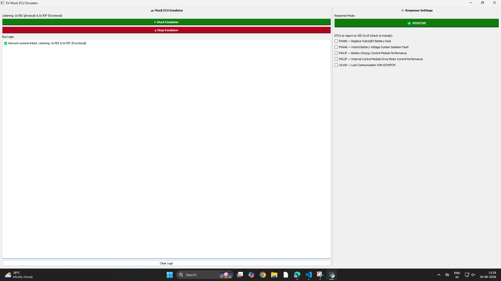
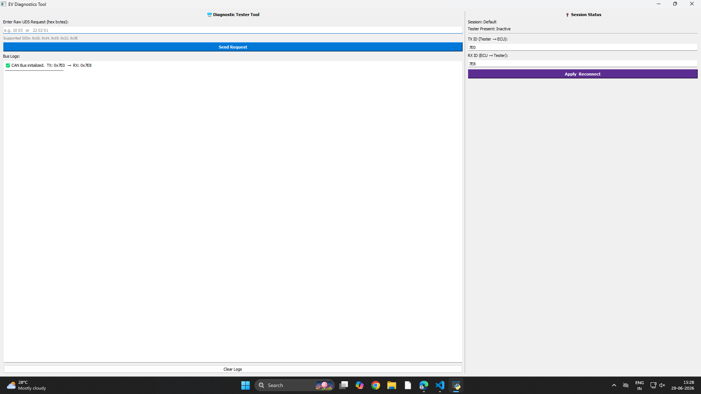

# Open-Source EV Diagnostic Tool 


## Project Overview
Welcome to the Open-Source EV Diagnostic Tool!

Our main objective is to create a free, accessible, and open-source software tool for diagnosing Electric Vehicles (EVs). Traditionally, the software needed to talk to a car's internal computers (ECUs) is expensive, closed-off, and hard to get. This project changes that by giving everyone the power to diagnose and test EVs using open-source Python code.

Key features of this tool: 

**Live Diagnostics:** It includes easy-to-use applications and interfaces that let you read live vehicle data, check for faults, and monitor the health of the car's systems.

**Open to Everyone:** Built for the community, it provides a clear, customizable foundation for developers, mechanics, and EV enthusiasts to use and improve without paying for proprietary licenses.


## Repository Navigation Guide

The codebase is organized into distinct, functional workspaces to isolate the documentation, configuration environment, core protocols, simulators, applications, and automated testing suites. Use the breakdown below to navigate the repository:

### 1.`Architecture_and_Docs/`
* **Purpose:** The structural and conceptual foundation of the project. Start your review here to understand the core logic before moving to the code.
* **Key Files:**
  * **`layered software architecture.png`** & **`simulation_block_diagram.png`**: Visual maps tracking component layers and block interactions.
  * **`Code_flow.pdf`** & **`data flow.png`**: Dynamic tracking of how message data passes between layers.
  * **`features_supported.xlsx`** & **`test_scenario.xlsx`**: Spreadsheet trackers mapping implemented features and verification scenarios.

### 2.`config/`
* **Purpose:** Single source of truth for global configuration constants and system path handling.
* **Key Files:**
  * **`user_config.py`**: Defines key parameters such as CAN IDs, timings, and protocol flags.
  * **`file_paths.py`**: Handles dynamic directory reference lookups across different environments.
  * **`ev_state_final.xlsx`** & **`decode_values.xlsx`**: Configuration lookup tables detailing EV parameter parsing rules and vehicle states.

### 3.`core/`
* **Purpose:** The main automotive protocol stack and vehicle interface abstraction engine.
* **Key Files:**
  * **`can_interface.py`**: Controls low-level bit/frame level management for CAN network sockets.
  * **`uds_layer.py`**: Packages and decodes diagnostics commands according to the ISO 14229 (UDS) standard.
  * **`transport_layer.py`**: Manages segmentation and flow control for multi-packet messaging sequences.
  * **`diagnostic_engine.py`** & **`translator.py`**: Orchestrates diagnostic tasks and parses byte payloads into readable metrics.
  * **`tester_present.py`**: Implements background heartbeat monitoring to maintain open diagnostic sessions.

### 4.`ECU_Simulations/`
* **Purpose:** Virtual vehicle emulation node. It acts as an offline sandbox, allowing the tool to run without connecting to a physical car.
* **Key Files:**
  * **`ecu.py`**: Core simulation script modeling an active vehicle controller node, handling request interception and synthetic data generation.
  * **`gui_ecu.py`**: Graphical user interface component providing visual monitoring for the active virtual ECU node.

### 5.`Diagnostic_Applications/`
* **Purpose:** The primary execution interface for the tool operator or diagnostic technician.
* **Key Files:**
  * **`main.py`**: The root application script used to launch core software diagnostics loops.
  * **`gui_main.py`**: A user-friendly graphical interface designed to trigger routines and track live automotive data visually.

### 6.`Testing_and_Validation/`
* **Purpose:** Layer-by-layer verification suites designed to validate codebase stability.
* **Key Files:**
  * **`layer1_tool_testing.py`** & **`layer1_ecu_testing.py`**: Validation scripts checking bottom-layer transceiver logic.
  * **`layer3_tool_testing.py`** & **`layer3_ecu_testing.py`**: Middle-layer integration scripts assessing diagnostic request formatting.
  * **`layer4_testing.py`** & **`layer5_testing.py`**: End-to-end operational assertions verifying application layers against the ECU simulator.

---


## Setting Up Your Local Environment
### Prerequisites
* Ensure Python 3.13+ is active on your host platform.
* Git installed on your local machine.

### Step-by-Step Execution
1. **Clone the project:**
```bash
   git clone [https://github.com/minaltawari/open_ev_diagnostic_tool.git](https://github.com/minaltawari/open_ev_diagnostic_tool.git)
   cd open_ev_diagnostic_tool
   ```
<br>

2. **Create and activate an isolated Python virtual environment:**
* **windows:** 
```bash
   python -m venv venv
     venv\Scripts\activate
 ```
<br>

* **macOS / Linux:**
```bash
     python3 -m venv venv
     source venv/bin/activate
 ```
<br>  

3. **Install required open-source packages:**
```bash
   pip install -r requirements.txt
```
<br>

4. **Spin up the Virtual Controller Node:**
*Open your first terminal window and run:
```bash
   python ECU_Simulations/gui_ecu.py
```
<br>


5. **Launch the Diagnostic Interface Application:**
*Open a second terminal window and run:
```bash
   python Diagnostic_Applications/gui_main.py
```

---


##  Step-by-Step Usage Guide (GUI)
Follow these exact steps to run your diagnostic test. You will need to set up the Emulator first, and then use the Tester Tool.

### Part 1:Mock ECU Emulator
The Mock ECU Emulator GUI


1. **Open the Emulator:** Run the ECU emulator script so the GUI opens.
2. **Turn on the Virtual Car:** Once the ECU GUI is opened, look at the big green button at the top and click **▶ Start Emulator**. 
3. **Check the Connection:** Look at the "Bus Logs" on the left. You should see a message saying "Network sockets linked." This means the virtual car is now awake and listening for messages on specific addresses (like `0x7E1`).
4. **Simulate a Broken Car (Optional):** Look at the right side under "Response Settings". If you want the virtual car to pretend it has a hardware issue, check one of the boxes under "DTCs to report", such as **P0A80 — Replace Hybrid/EV Battery Pack**.
5. **Leave it running:** Do not close this window! Move it to the side of your screen so you can watch it later.
6. **Clear the Screen:** Once your "Bus Logs" get too cluttered with messages, just click the **Clear Logs** button at the very bottom of the window to wipe it clean for your next test.

### Part 2: Sending Commands with the Diagnostic Tester
The Diagnostic Tester GUI
 

1. **Open the Tester Tool:** Run the main tool script so the Diagnostic Tester GUI opens.
2. **Check the Addresses:** Once the tool GUI is opened, look at the right side of the screen under the "Session Status" panel. You need to check the addresses you want to communicate with:
   * **TX ID** is the address you are sending the message *to* (make sure it says `7E1`).
   * **RX ID** is the address you expect the car to reply *from* (make sure it says `7E9`).
3. **Lock in the Connection:** Click the purple **Apply Reconnect** button just below the addresses to lock them in.
4. **Type a Command:** Now, look at the top left where it says "Enter Raw UDS Request". This is where you type the hex code you want to send to the car. Type `22 02 01` (make sure to include the spaces). This specific code asks the car to read a piece of data.
5. **Send It:** Click the blue **Send Request** button.
6. **Read the Results:** Look at the "Bus Logs" window just below the button. You will see your `TX` (transmit) message go out, and immediately after, you will see the `RX` (receive) message come back from the virtual car! If you look over at your Emulator window, you will also see the message pop up in its logs.
7. **Clear the Screen:** Once your "Bus Logs" get too cluttered with messages, just click the **Clear Logs** button at the very bottom of the window to wipe it clean for your next test.


---


## Dynamic Feature Tracing Workflow
To fully understand how features flow through the code when using the built-in simulator, here is the exact step-by-step lifecycle of a diagnostic request mapped across the repository directories:

```text
[ USER INTERFACE ]
      │
      │  1. User requests a specific vehicle parameter (e.g., Read Battery Voltage)
      │
      ▼
[ DIAGNOSTIC APPLICATION ] (Diagnostic_Applications/gui_main.py)
      │
      │  2. Translates the UI click into a system command
      │
      ▼
[ DIAGNOSTIC ENGINE ] (core/diagnostic_engine.py)
      │
      │  3. Orchestrates the diagnostic sequence and looks up protocol rules
      │
      ▼
[ UDS & TRANSPORT LAYER ] (core/uds_layer.py / transport_layer.py)
      │
      │  4. Constructs the UDS payload (e.g., Service 0x22 ReadDataByIdentifier) 
      │     and handles multi-frame message segmentation (ISO-TP)
      │
      ▼
[ CAN INTERFACE ] (core/can_interface.py)
      │
      │  5. Wraps the UDS payload into standard 8-byte CAN frames and applies 
      │     the correct transmission Arbitration IDs
      │
      ▼
====================== [ VIRTUAL CAN BUS LOOPBACK ] ======================
      │
      ▼
[ VIRTUAL ECU SIMULATOR ] (ECU_Simulations/ecu.py)
      │
      │  6. Intercepts the CAN frame, unpacks the UDS request, and processes it
      │  7. Generates a synthetic response using configuration data and sends 
      │     a response CAN frame back onto the virtual bus
      │
      ▼
====================== [ VIRTUAL CAN BUS LOOPBACK ] ======================
      │
      ▼
[ CAN INTERFACE ] (core/can_interface.py)
      │   
      │  8. Captures the incoming simulated CAN response frames
      │
      ▼
[ TRANSLATOR & DECODER ] (core/translator.py)
      │
      │  9. Unpacks the CAN frame and maps the raw hexadecimal payload to 
      │     real-world engineering values using `config/decode_values.xlsx`
      │
      ▼
[ USER INTERFACE ] (Diagnostic_Applications/gui_main.py / Logs)

         10. Renders the final, readable data to the screen (e.g., "380 Volts")
```

---

